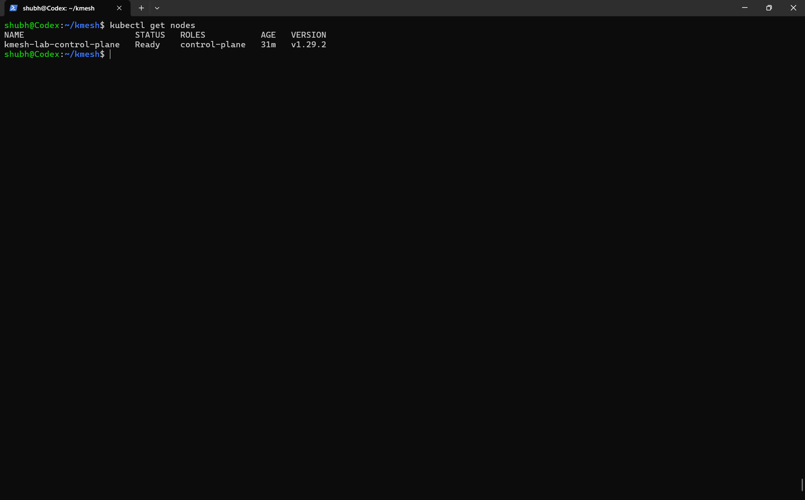
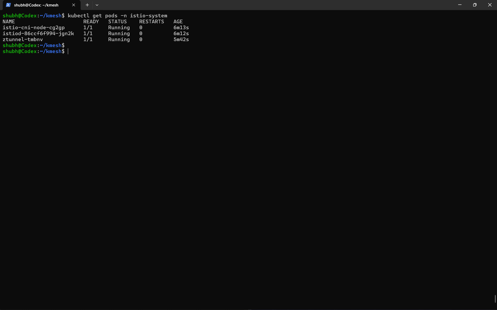
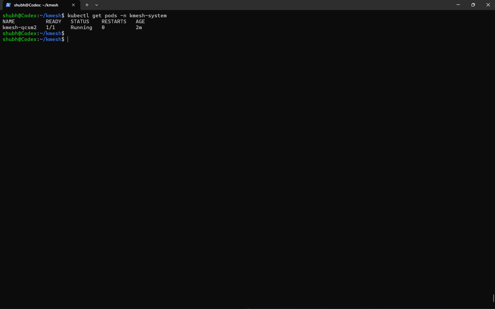

kmesh-setup-notes
Kmesh Local Setup
Steps I followed
Installed dependencies Go Docker kind kubectl

Created Kubernetes cluster

kind create cluster --name kmesh-dev
# Kmesh Setup Notes

## 📌 Overview
I successfully set up Kmesh locally using Kubernetes and Istio.  
This repository contains proof of my setup and basic steps I followed.

---

## ⚙️ What I Did

- Created a local Kubernetes cluster using kind  
- Installed Istio  
- Cloned the Kmesh repository  
- Built and deployed Kmesh  
- Verified that Kmesh is running successfully  

---

## 📸 Proof of Setup

### Kubernetes Cluster

### Istio Running

### Kmesh Running

---

## 🚀 Status
Kmesh is successfully running in my local environment and I am ready to start contributing.
